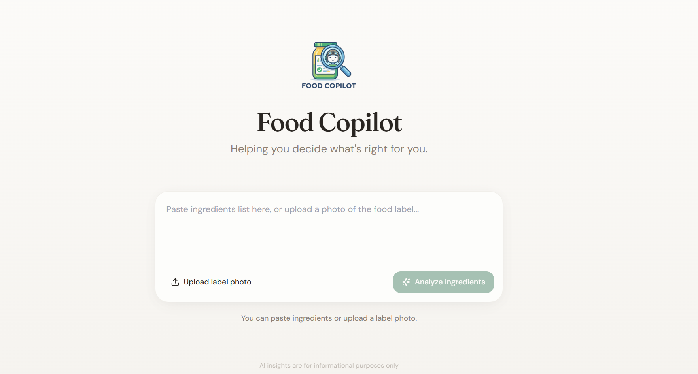
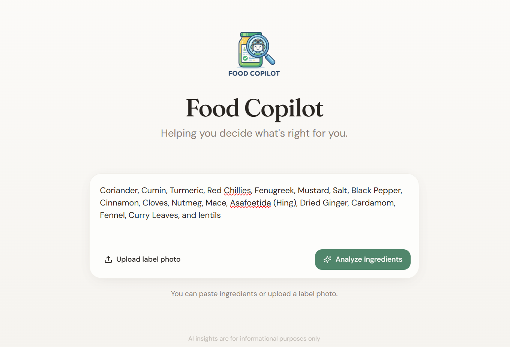
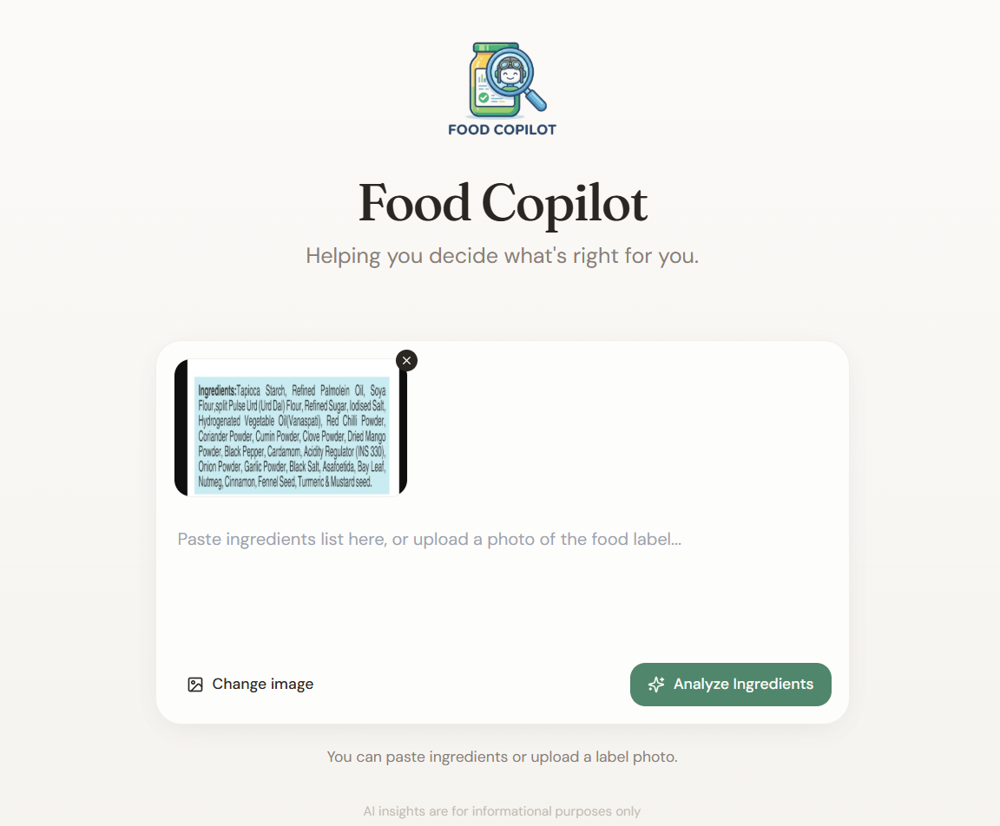
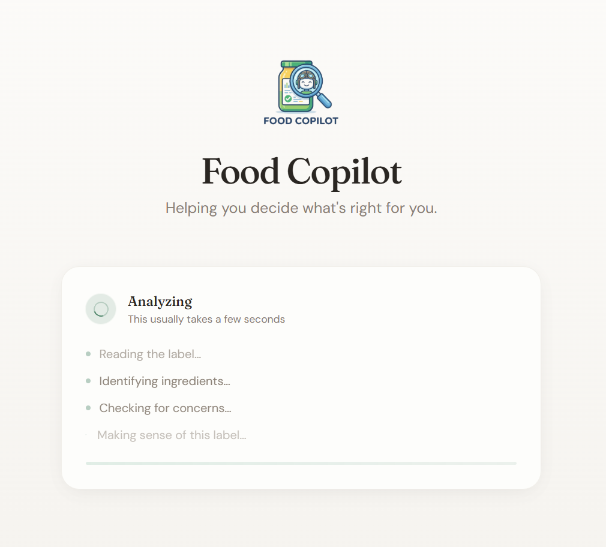
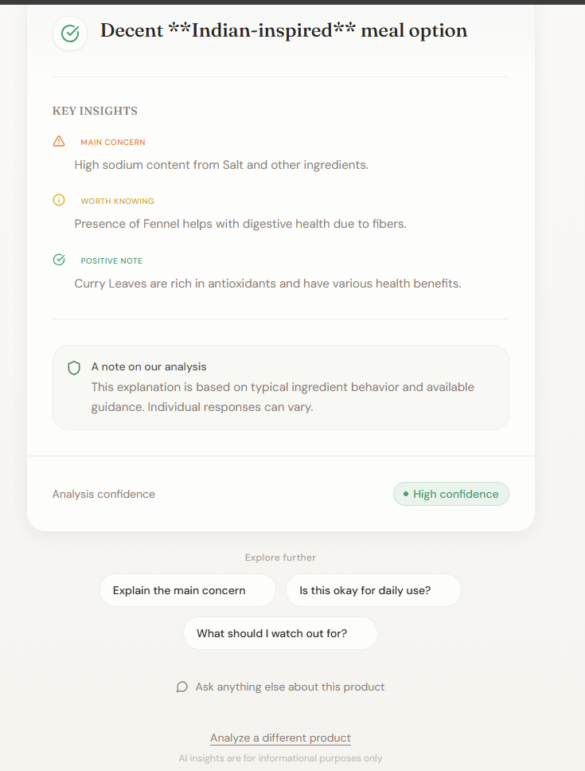
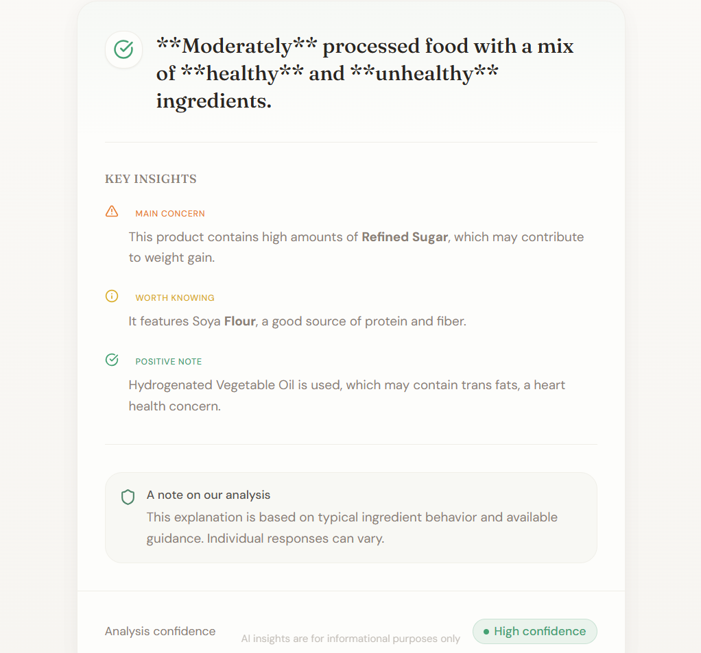
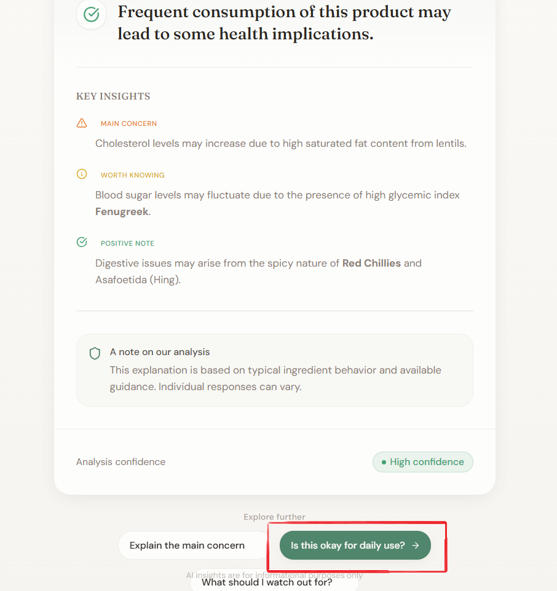
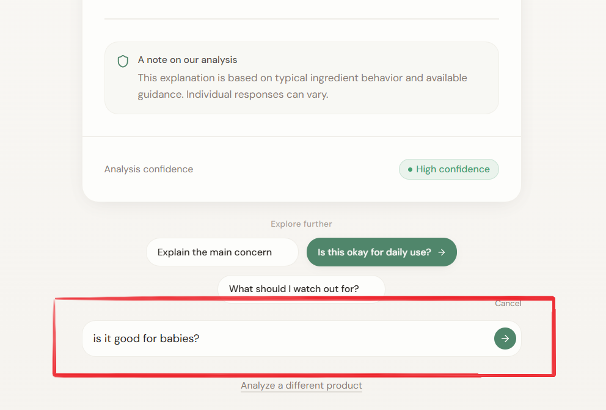
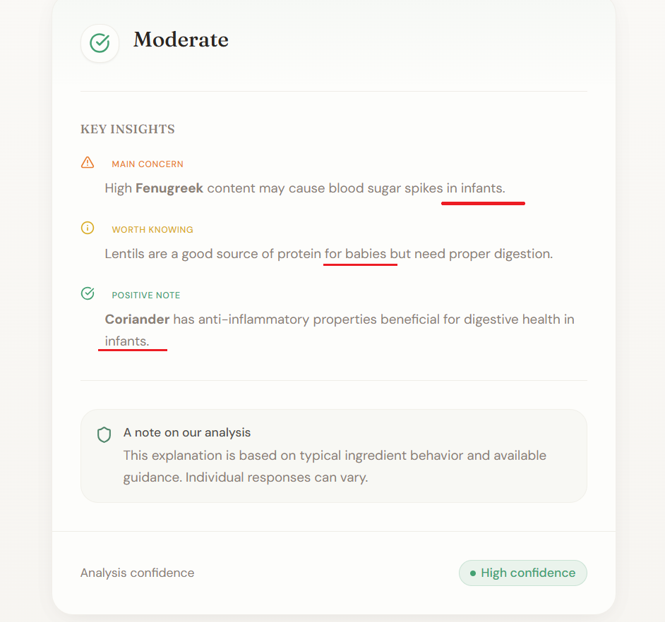

# 🥗 Food Copilot  
**An AI-Native Consumer Health Experience**

Food Copilot reimagines how people understand food ingredients at the exact moment decisions matter.  
Instead of listing raw data, it acts as an **intelligent co-pilot** that interprets food labels, explains trade-offs, highlights concerns, and communicates uncertainty clearly.

This project was built for the **AI-Native Consumer Health Experience** challenge.


## **Checkout:** [Live Demo](https://food-copilot.netlify.app/)

---

##  Problem Context

Food labels are designed for **regulatory compliance**, not **human understanding**.

Consumers are expected to interpret:
- Long ingredient lists  
- Unfamiliar chemical names  
- Conflicting or evolving health guidance  

Existing tools fail because they:
- Dump raw ingredient data  
- Require high-effort manual filtering  
- Treat AI as a feature, not the interface  

**Result:** confusion at the moment of choice.

---

## Our Solution

**Food Copilot** is an AI-native web experience where:
- AI is the **primary interface**, not an add-on
- User intent is **inferred**, not configured
- Complex ingredient data is translated into **clear, human insight**
- Cognitive load is minimized at decision time

---

## 🧠 What Makes It AI-Native

| Traditional Apps | Food Copilot |
|------------------|-------------|
| Forms & filters | Intent-first interaction |
| Raw data output | Reasoned explanations |
| User does thinking | AI does cognitive work |
| Static UI | Adaptive, conversational |

The system behaves like a **co-pilot**, not a lookup tool.

---

## ✨ Key Features

### 1️. Ingredient Understanding
- Accepts **raw text** or **real product label images**
- Uses OCR to extract ingredient text from images
- Automatically detects and cleans ingredient lists

### 2. Reasoning-Driven Insights
- Generates **exactly three insights**:
  - Main concern
  - Worth knowing
  - Positive note
- Each insight focuses on a **different aspect**
- Short, scannable, consumer-friendly language

### 3. Keyword Emphasis
- Important ingredients are **bolded automatically**
- No markdown artifacts or formatting noise
- Emphasis is deterministic, not random

### 4. Honest Uncertainty
- Explicit uncertainty note in every response
- No medical claims or definitive health advice

### 5. Follow-Up Intelligence
- One-click follow-ups:
  - “Explain the main concern”
  - “Is this okay for daily use?”
  - “What should I watch out for?”
- Custom free-text questions supported
- Output updates dynamically without resetting context

### 6. Memory-Aware Reasoning
- Backend stores previous analyses
- Uses lightweight memory to adapt explanations over time

---

##  Example Flow

1. User pastes ingredients or uploads label photo  
2. AI extracts ingredient text  
3. System infers what the user likely cares about  
4. AI generates:
   - Clear summary
   - Three structured insights
   - Highlighted ingredients
   - Confidence level  
5. User explores follow-ups without friction  

---

## 📸 Demo Screenshots

The following screenshots illustrate the complete AI-native user journey — from uncertainty to clear, actionable understanding.

---

### 1️. Landing Experience


---

### 2️. Ingredient Input (Text & Image)

<table>
  <tr>
    <td>
      
    </td>
    <td>
      
    </td>
  </tr>
</table>



<h3 align="center">Loading Screen</h3>

---

### 3. Decision Summary & Detected Ingredients
<table>
  <tr>
    <th width="50%">Decision Summary (Text)</th>
    <th width="50%">Decision Summary (Image)</th>
  </tr>
  <tr>
    <td>
      
    </td>
    <td>
      
    </td>
  </tr>
</table>

---

### 6️. Follow-Up Interaction


---

### 7. Custom Follow-Up Interaction
<table>
  <tr>
    <th width="50%">Custom Follow Up Input</th>
    <th width="50%">Custom Follow Up Output</th>
  </tr>
  <tr>
    <td>
      
    </td>
    <td>
      
    </td>
  </tr>
</table>


---


## Demo Video

https://github.com/user-attachments/assets/aebd2929-6760-4791-92c2-6c96a61eff0c

---


## System Architecture

### Frontend
- **React + TypeScript**
- **Vite** for fast builds
- **Tailwind CSS** for clean, minimal UI
- **Framer Motion** for subtle, meaningful animations
- **shadcn/ui** component system

### Backend
- **Node.js + Express**
- **Groq LLM API** for fast, high-quality reasoning
- OCR via **Tesseract.js**
- Lightweight memory store (JSON-based)
- Deterministic post-processing for emphasis and formatting

### AI Design
- Reasoning over completeness
- No giant ingredient databases
- No hard-coded health rules
- Uses AI to interpret, summarize, and contextualize

---

## 📂 Project Structure

```text
Food_Copilot/
├── public/
│   ├── header-image.png
│   ├── _redirects
│
├── src/
│   ├── components/
│   │   ├── InputSection.tsx
│   │   ├── InsightCard.tsx
│   │   ├── FollowUpChips.tsx
│   │   └── ThinkingState.tsx
│   │
│   ├── pages/
│   │   └── Index.tsx
│   │
│   ├── lib/
│   │   └── mockData.ts
│   │
│   └── types/
│       └── analysis.types.ts
│
├── server/
│   ├── routes/
│   │   └── analyze.ts
│   │
│   ├── services/
│   │   ├── reasoning.service.ts
│   │   ├── llm.service.ts
│   │   └── memory.service.ts
│   │
│   ├── types/
│   │   └── backend-analysis.types.ts
│   │
│   └── index.ts
│
├── .gitignore
├── package.json
└── README.md
````

---

## ⚙️ Local Setup

### 1️. Clone the Repository

```bash
git clone https://github.com/5umitpandey/IIT_Guwahati_Encode.git
cd IIT_Guwahati_Encode
```

### 2️. Install Frontend Dependencies

```bash
npm install
```

### 3️. Install Backend Dependencies

```bash
cd server
npm install
cd ..
```

### 4️. Environment Variables

Create `server/.env`:

```env
GROQ_API_KEY=your_groq_api_key_here
```

### 5️. Run Locally

Frontend:

```bash
npm run dev
```

Backend:

```bash
npm run server
```

---

## 🚀 Deployment

### Frontend (Netlify – Free)

* Build command: `npm run build`
* Publish directory: `dist`
* SPA routing enabled via `_redirects`

### Backend (Render – Free)

* Root directory: `server`
* Build command: `npm install && npm run build`
* Start command: `node dist/index.js`
* Environment variable: `GROQ_API_KEY`

---

## 🔒 Anti-Goals (What This Is NOT)

* ❌ Ingredient database browser
* ❌ Nutrition facts table
* ❌ Medical diagnosis tool
* ❌ OCR accuracy benchmark
* ❌ AI bolted onto a traditional app

---

## 🏆 Design Category Focus

**Best AI-Native Experience**

Food Copilot prioritizes:

* Intent inference over configuration
* Reasoning over raw data
* Clarity over completeness
* User trust over false certainty

---

## Future Improvements

* Real-time nutrition guidelines integration
* Region-specific ingredient regulation context
* Personalized dietary preference adaptation
* Interactive dashboards
* Multi-language label understanding

---

## ⚠️ Disclaimer

Food Copilot provides **informational insights only**.
It does not offer medical advice or replace professional guidance.


---


<div align="center">

## 👥 Team

**Team Name**: ASHSUM
<br>
**Team Members**:

<table>
  <tr>
    <td align="center">
      <br/>
      <a href="https://github.com/ashir1s">Ashiwad Sinha</a>
    </td>
    <td align="center">
      <br/>
      <a href="https://github.com/5umitpandey">Sumit Pandey</a>
    </td>
  </tr>
</table>

</div>

## Final Note

This project demonstrates how AI can reduce cognitive load and help people make better everyday decisions — not by giving more data, but by doing the thinking for them.
